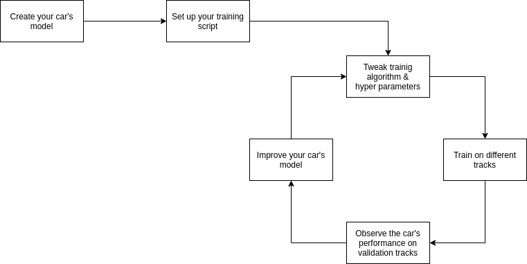

# NNFL-Assignment-2: Part II - racing cars

## 1. Introduction
Welcome to this part of Assignment 2. This project is an attempt to teach how to train machine learning models in the real world.  

We have created a toy car racing environment where you can easily create, train and race your own cars. You have to create and train cars that can efficiently maneuver different kinds of tracks.

To do this, there are two main things you need to set up:

**First, you will need to set up a machine learning model for the car**. This is how your car will convert the parameters it receives into concrete actions (how fast to accelerate and in what direction). You will need to convert the given parameters into useful features and then combine these features and weights to create the final acceleration values. A feature is a combination of the parameters that have the potential to be more important than the individual parameters themselves. Generally, you have machine learning algorithms (like Neural Networks) creating and choosing these features for you (as hidden nodes), but we encourage you to think and manually choose these features. After selecting appropriate features

**Secondly, you will need to train and validate your cars**. Validating your cars is especially important as you don't know the final tracks that your cars will be evaluated on, so it is important to make sure that your car can run well on tracks it hasn't been trained on as well. Your workflow should look something like the one given below:



## 2. Installing
You will need [Python](https://www.python.org/) (3.7+) and it's package manager [pip](https://pypi.org/project/pip/)

The following python packages are also needed to run the project:  
- imageio
- matplotlib
- numpy
- scikit-image
- tqdm

These can be installed individually or all of them can be installed using the commad:
```
pip3 install -r requirements.txt
```


## 3. Objectives
Your primary objective is simple - train your cars so that they can race on any given track as fast as possible.

But you can subdivide these objectives further:

- Design cars which can efficiently maneuver any given track
- Maximize the distance travelled by your car
- Minimize the time taken to reach the finish line
- And any other objective that you find interesting! (like ensuring that the car moves smoothly)

To do this, you have to do two things:

1. Implement the `MyCar.move()` function. This function takes `weights` and `parameters` as inputs (explained later).

2. Train your car on different tracks. You can do so using the training scripts we have provided (GA and PSO) or you can write your own.

## 4. the Car interface

### 4.1 Initializing your Car

- The Weights and Id of a car should be initialized before running it on a given track.
- You can initialize your car at the time of the creation of a car object by passing its ID and a weight matrix as arguments to your `MyCar` class.
- You can use NumPy’s random array generator or any other method to generate the initial weight matrix.
- In case you are using the default GA/PSO templates the car has already been initialized with some random weights.
> **NOTE**: The Parameters of the car have already been initialized in the base_car.py file and you do not need to worry about it.

### 4.2 The move Function

The `move()` function acts as the combination of the Steering wheel and Engine of the car.

- The function takes the parameters and weights of the car as input and returns the car's acceleration.
- You are required to establish a relation between the car's parameters and acceleration using the input weights.
- It is not necessary to use all parameters in the relation, and hence you should extract only the essential features from the parameters.
- You can use any combination of weights and features (Linear or Non-Linear) to calculate acceleration.
- A sample relation is available in the comment section of the move function.
- While establishing the relation, make sure that the car's acceleration is within the permissible limits.

### 4.3 Available Parameters:

These are the parameters that are available to your car. Essentially this is what your car can "see" and use to make decisions about its acceleration.

- x, y: Position along the x and y-axis.
- prev_x, prev_y: Previous position along the x and y-axis.
- vx, vy: Velocity along the x and y-axis.
- prev_vx, prev_vy: Previous Velocity along the x and y-axis.
- dist_left: Distance b/w the car's left side and the track.
- dist_right: Distance b/w the car's right side and the track.
- dist_front_left: Distance at a 45-degree angle to the car's left.
- dist_front_right: Distance at a 45-degree angle to the car's right.

> For information about the range of each parameter check the comment section of the move() function in the templates.

### 4.4 The fitness function
You can find out the fitness of our car using the `run()` function.

The run function takes two arguments:

- track_path: Path to an image of the track on which you want to run your car
- save (optional): Path to save a visualization of the
> Use the save parameter only when required as it is significantly slower to
visualize the car instead of just getting its fitness value

- The fitness function is defined as the average velocity of your car. We calculate it
as:
```
Total distance travelled by your car (in the x-direction) / Total time taken
```

- The fitness value is guaranteed to be positive (and is usually between 0 - 1.5)


### 4.5 Important points to keep in mind

- Your car's velocity and acceleration will be clipped to be between the specified limits
- If your car touches the racetrack boundary, it will stop immediately. This will
negatively impact it's fitness value (as it slows down your car),
so try to ensure that your car stays away from the racetrack boundaries.

## 5. Creating tracks

- You can draw your own tracks and race cars on your own tracks.
- Tracks can be drawn using any simple drawing software (Paint on windows / Pinta on Linux)
- If you don't have any drawing software, use online software (like [this one](https://www.youidraw.com/apps/painter/#))
- Try to draw your tracks on a square canvas (to maintain it's aspect ratio)
- We have provided sample tracks to get you started

> **NOTE**: Your tracks can't loop around or have any vertical lines (Think of the tracks as one-to-one functions)

> Try to draw tracks that are as diverse as possible. For example, does your car
perform equally well on wide/narrow tracks? What about tracks with sharp turns?

## 6. Templates
We have provided a few templates to kickstart your training process.

### 6.1 Template 2 - a simple car
1. This template invites you to present your own unique approach to the car problem.
2. You are free to use any method to describe the movement of the car on the track in the file template_2_car.py.
3. You are free to use any algorithm or a combination of algorithms for optimizing the car weights in the file named as template_2_train.py

### 6.2 Template 1 - Sophisticated cars that can be trained using a GA / PSO
1. The GA/PSO Templates (template_1_car_ga.py/ template_1_car_pso.py) uses your custom car (MyCar) from template_1_car.py to make different members (random weights) of the population.
2. The GA/PSO Algorithm would then try to find the optimal car by iteratively improving the candidate cars (swarm) by running them on the track.
3. After all iterations, the template saves the best car from the population.
4. You can improve the solution of the GA/PSO algorithm by changing the values of the hyperparameters (hyper_params) which control the training process.
5. All the necessary information about hyperparameter is given at the end of the GA/PSO template.

You are not restricted to use only these two approaches, you can even try and use a combination
of these approaches.

## 7. Submission guidelines
For this assignment, you will have to submit 2 files:  
- your car (.py)
- your weights (.npy)

These submissions will be accepted as individual files named as your ID.

A sample submission is:
- 2017B4A70495P.py  (Must contain a class with the name `MyCar`)
- 2017B4A70495P.npy (These weights must be generated using your car's `save` function)

## 8. Evaluation
The car (and its weights) that you submit will be tested on 5 tracks. The total fitness of your cars will be computed and all students will be ranked according to their car's total fitness.
Marks will be allotted based on your rank in the races.

**On your marks, Get Set, Go!**
